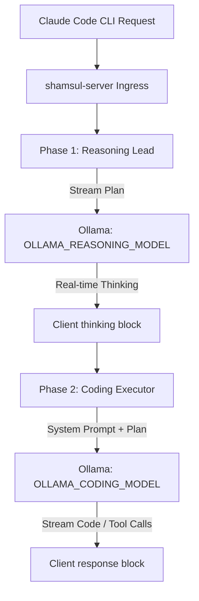

# shamsul-server: Context Engineering Tuning Guide

This document describes the design of the server-side context-engineering workflow in `shamsul-server` and provides instructions on how to tune and adjust it for your specific local LLM setup.

---

## 1. System Architecture

The core of `shamsul-server` is a two-stage context-engineering pipeline that splits agentic coding tasks into planning and execution phases.



### Phase 1: Reasoning Lead (Planning)
* **Role**: Analyzes the codebase context, previous tool results, and the user's query to formulate a step-by-step plan.
* **Stream**: The reasoning lead's output is streamed back to the client inside native Anthropic `<thinking>` blocks, showing you what the planner is thinking in real-time.

### Phase 2: Coding Executor (Execution)
* **Role**: Translates the step-by-step reasoning plan into actual code modifications and specific tool calls (e.g. `view_file`, `replace_file_content`).
* **Stream**: Streams code completions and JSON tool parameters directly back to the Claude Code CLI.

---

## 2. Tuning the System Prompts

You can customize how the reasoning model structures its plans by modifying the prompts in `providers/ollama/client.py`.

### Tuning the Planner System Prompt
Look for the `reasoning_system` variable in [client.py](file:///d:/NSU/cse327/free-claude-code/providers/ollama/client.py):
```python
reasoning_system = (
    "You are the Lead Reasoning Agent. Your job is to analyze the user request and codebase context, "
    "and construct a precise, step-by-step instruction plan for the Coding Agent to execute. "
    "Detail the required logic, edge cases, and which tools (e.g. read_file, replace_file_content) should be used. "
    "Keep your response highly structured, action-oriented, and focused on planning. Do not write the code itself, "
    "just guide the execution agent."
)
```
* **To make planning more thorough**: Add instructions to force the planner to explore the code structure before suggesting changes (e.g., `"Always suggest using `view_file` to inspect files before editing them."`).
* **To constrain token usage**: Instruct the planner to be concise (e.g., `"Limit your plan to at most 5 bullet points."`).

### Adjusting How the Plan is Injected into the Executor
Look for the `guided_system` construction:
```python
guided_system = (
    f"{original_system}\n\n"
    f"--- LEAD REASONING AGENT PLAN ---\n"
    f"{reasoning_plan}\n\n"
    f"Execute the step-by-step instructions from the Lead Reasoning Agent plan above."
)
```
You can modify this format to change how much weight the coding model gives to the plan vs. its original system instructions.

---

## 3. Model Configuration (.env)

Adjust the models assigned to each role in your `.env` file to suit your local GPU capabilities:

```env
# The Reasoning Lead Model (Fast, good at planning/logic)
OLLAMA_REASONING_MODEL="gemma2:9b"

# The Coding Execution Model (Fine-tuned for tool calling and syntax)
OLLAMA_CODING_MODEL="qwen2.5-coder:7b"
```

### Recommended Model Pairs
1. **High Performance (16GB+ VRAM)**:
   * Reasoning: `llama3.3:70b` (quantized) or `deepseek-r1:14b` / `deepseek-r1:32b`
   * Coding: `qwen2.5-coder:14b` or `qwen2.5-coder:32b`
2. **Standard (8GB - 12GB VRAM)**:
   * Reasoning: `gemma2:9b` or `deepseek-r1:8b`
   * Coding: `qwen2.5-coder:7b`
3. **Resource Constrained (<8GB VRAM)**:
   * Reasoning: `llama3.2:3b`
   * Coding: `qwen2.5-coder:1.5b` or `qwen2.5-coder:3b`
